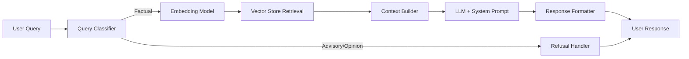
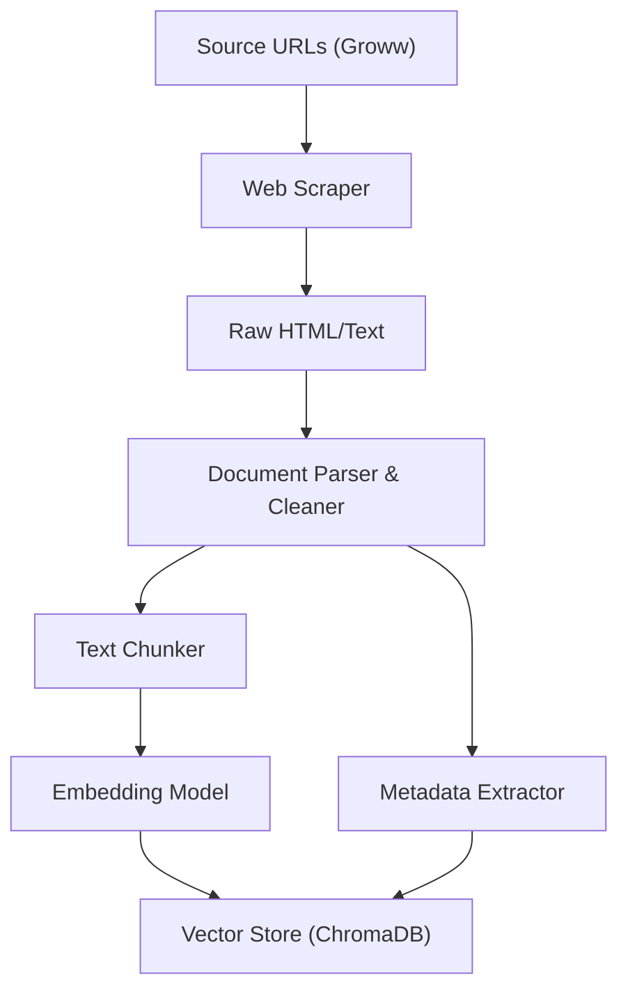
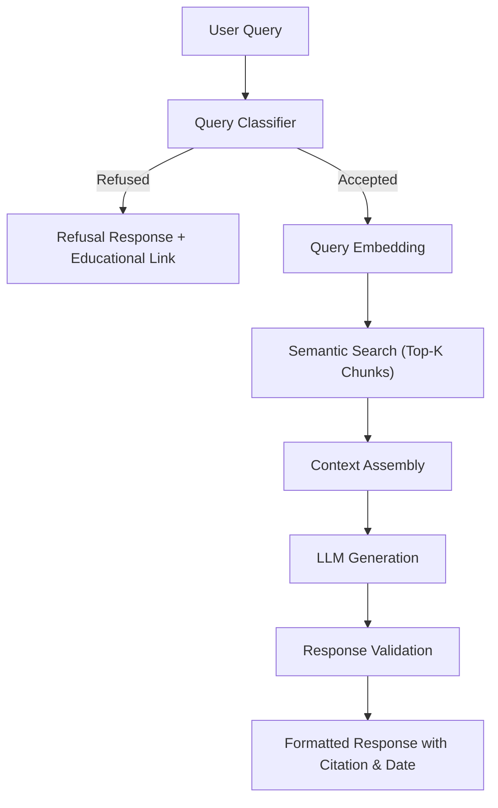
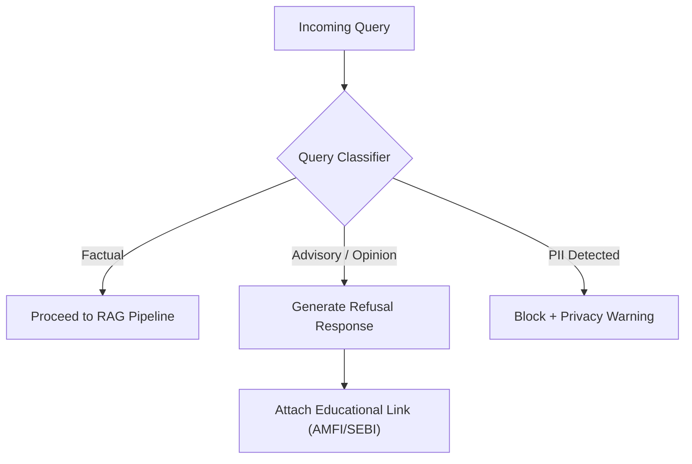
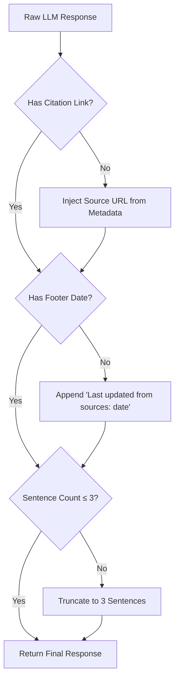
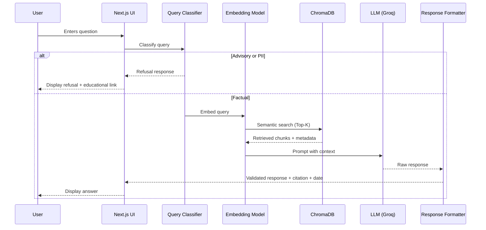

# Architecture: Mutual Fund FAQ Assistant (RAG Chatbot)

## 1. System Overview

The Mutual Fund FAQ Assistant is a **Retrieval-Augmented Generation (RAG)** chatbot that answers factual queries about various mutual fund schemes. It retrieves relevant chunks from a pre-indexed corpus consisting **exclusively** of the provided Groww URLs (no PDFs or other external sources are used), and generates concise, source-backed responses using a Large Language Model (LLM).



---

## 2. High-Level Architecture

The system is composed of **two main pipelines**:

### 2.1 Offline Pipeline (Data Ingestion & Indexing)

Runs once (or periodically) to build the knowledge base.



### 2.2 Online Pipeline (Query & Response)

Handles user queries in real-time.



---

## 3. Component Details

### 3.1 Data Ingestion Layer

| Component | Purpose | Details |
|---|---|---|
| **Web Scraper** | Extract content from source URLs | Uses `BeautifulSoup` / `requests` to scrape scheme pages from Groww |
| **Document Parser** | Clean and structure raw content | Strips HTML tags, navigation elements, ads; extracts meaningful text |
| **Metadata Extractor** | Capture source metadata | Extracts scheme name, source URL, and scrape date for each document |

> [!IMPORTANT]
> **Strict Source Constraint**: The system will EXCLUSIVELY use the content scraped directly from these 5 provided Groww URLs. No external PDFs (like SIDs, KIMs, or factsheets), third-party sites, or other supplementary documents will be downloaded, parsed, or included in the vector store.

**Source URLs (5 schemes):**

| Scheme | Category | URL |
|---|---|---|
| HDFC Mid-Cap Opportunities Fund | Mid-Cap | [Link](https://groww.in/mutual-funds/hdfc-mid-cap-fund-direct-growth) |
| HDFC Small Cap Fund | Small-Cap | [Link](https://groww.in/mutual-funds/hdfc-small-cap-fund-direct-growth) |
| ICICI Prudential Technology Fund | Sectoral | [Link](https://groww.in/mutual-funds/icici-prudential-technology-fund-direct-growth) |
| Nippon India Small Cap Fund | Small-Cap | [Link](https://groww.in/mutual-funds/nippon-india-small-cap-fund-direct-growth) |
| Axis Small Cap Fund | Small-Cap | [Link](https://groww.in/mutual-funds/axis-small-cap-fund-direct-growth) |

---

### 3.2 Chunking Strategy

The cleaned documents are split into manageable chunks for embedding and retrieval.

| Parameter | Value | Rationale |
|---|---|---|
| **Chunk Size** | ~500 tokens | Balances context richness with retrieval precision |
| **Chunk Overlap** | ~50 tokens | Prevents loss of information at chunk boundaries |
| **Splitter** | `RecursiveCharacterTextSplitter` | Respects paragraph and sentence boundaries |

Each chunk is stored with the following metadata:

```json
{
  "scheme_name": "HDFC Mid-Cap Opportunities Fund",
  "source_url": "https://groww.in/mutual-funds/hdfc-mid-cap-fund-direct-growth",
  "category": "Mid-Cap",
  "scraped_date": "2026-08-03",
  "chunk_index": 3
}
```

---

### 3.3 Embedding & Vector Store

| Component | Choice | Rationale |
|---|---|---|
| **Embedding Model** | `BAAI/bge-small-en-v1.5` | Highly performant, fast, state-of-the-art embedding model |
| **Vector Store** | **ChromaDB** (persistent, local) | Simple setup, no external infra, supports metadata filtering |
| **Similarity Metric** | Cosine Similarity | Standard for semantic text search |
| **Top-K Retrieval** | K = 3–5 | Provides sufficient context without overwhelming the LLM |

**Alternative options** (if scaling is needed later):

- FAISS for larger corpora
- Pinecone / Weaviate for cloud-hosted vector stores

---

### 3.4 Query Classification & Guardrails

Before retrieval, every query passes through a **classifier** that determines whether it is factual or advisory.



#### Classification Approach

| Method | Description |
|---|---|
| **Keyword / Pattern Matching** | Detect advisory phrases: *"should I"*, *"which is better"*, *"recommend"*, *"best fund"* |
| **LLM-based Classification** | Use the LLM itself with a classification prompt as a fallback for ambiguous queries |

#### PII Detection

A lightweight regex-based filter scans the query for:

- PAN format: `[A-Z]{5}[0-9]{4}[A-Z]{1}`
- Aadhaar format: `[0-9]{12}`
- Phone numbers: `[0-9]{10}`
- Email patterns

> [!CAUTION]
> If PII is detected, the query is **immediately blocked** with a privacy notice. No data is logged or stored.

---

### 3.5 LLM Integration

| Parameter | Value |
|---|---|
| **LLM Provider** | Groq API |
| **Model** | `llama3-8b-8192` (via Groq) |
| **Temperature** | `0.1` (low creativity, high factuality) |
| **Max Output Tokens** | `150` (enforces 3-sentence limit) |

#### System Prompt (Core)

```text
You are a facts-only mutual fund FAQ assistant. You answer questions about mutual fund schemes using ONLY the provided context.

RULES:
1. Answer in a maximum of 3 sentences.
2. Include exactly one source citation link from the context metadata.
3. End every response with: "Last updated from sources: <date>"
4. Do NOT provide investment advice, opinions, or recommendations.
5. Do NOT compare fund performance or calculate returns.
6. If the context does not contain the answer, say: "I don't have this information in my current sources."
7. For performance-related queries, respond only with a link to the official factsheet.
```

#### Prompt Template

```text
Context:
{retrieved_chunks}

Source URLs:
{source_urls}

User Question: {user_query}

Respond following the system rules strictly.
```

---

### 3.6 Response Formatter

Every response is post-processed to ensure compliance:



**Final response format:**

```
<Answer in ≤ 3 sentences>

Source: <URL>
Last updated from sources: <date>
```

**Refusal response format:**

```
I'm a facts-only assistant and cannot provide investment advice or fund comparisons.
You can learn more about mutual funds here: https://www.amfiindia.com/investor-corner/knowledge-center.html

Facts-only. No investment advice.
```

---

## 4. User Interface

A minimal web-based chat interface.

### 4.1 UI Components

| Component | Description |
|---|---|
| **Header** | App title + disclaimer badge: *"Facts-only. No investment advice."* |
| **Welcome Panel** | Greeting message with 3 clickable example questions |
| **Chat Area** | Scrollable message thread (user messages + bot responses) |
| **Input Bar** | Text input with send button |

### 4.2 Example Questions (Displayed on Load)

1. *"What is the expense ratio of HDFC Mid-Cap Opportunities Fund?"*
2. *"What is the minimum SIP amount for Axis Small Cap?"*
3. *"Who is the fund manager for Nippon India Small Cap?"*

### 4.3 Tech Stack (UI)

| Layer | Choice |
|---|---|
| **Frontend** | Next.js (React), CSS Variables for Dark Mode |
| **Backend API** | FastAPI (Python) serving the RAG pipeline |

---

## 5. Project Structure

```
RAG CHATBOT/
├── docs/
│   ├── problemstatement.md
│   └── architecture.md
├── data/
│   ├── raw/                  # Scraped HTML/text files
│   └── processed/            # Cleaned and chunked documents
├── vectorstore/              # ChromaDB persistent storage
├── frontend/                 # Next.js React frontend
│   └── src/app/              # Next.js App Router UI
├── src/
│   ├── scraper.py            # Web scraping logic
│   ├── parser.py             # Document cleaning & chunking
│   ├── embedder.py           # Embedding generation & indexing
│   ├── retriever.py          # Vector search & context assembly
│   ├── classifier.py         # Query classification & PII detection
│   ├── generator.py          # LLM prompt construction & response
│   ├── formatter.py          # Response validation & formatting
│   └── main.py               # FastAPI backend entry point
├── config/
│   └── settings.py           # API keys, model params, chunk config
├── requirements.txt
├── .env                      # Environment variables (API keys)
├── .gitignore
└── README.md
```

---

## 6. Tech Stack Summary

| Layer | Technology | Purpose |
|---|---|---|
| **Language** | Python 3.10+, TypeScript | Core development languages |
| **Web Scraping** | `requests` + `BeautifulSoup4` | Extract content from Groww URLs |
| **Text Processing** | `LangChain` text splitters | Chunking and document handling |
| **Embeddings** | `sentence-transformers` (BAAI/bge-small-en-v1.5) | Generate vector embeddings |
| **Vector Store** | ChromaDB | Store and query embeddings |
| **LLM** | Groq (Llama 3.3) | Generate natural language responses |
| **Backend API** | FastAPI | Expose RAG pipeline as a REST endpoint |
| **UI** | Next.js (React) | Chat interface |
| **Environment** | `python-dotenv` | Manage API keys securely |

---

## 7. Data Flow Summary



---

## 8. Key Design Decisions

| Decision | Choice | Rationale |
|---|---|---|
| Local embeddings over API-based | `BAAI/bge-small-en-v1.5` | Top-tier open-source embeddings, no cost per query, privacy-friendly |
| ChromaDB over FAISS | ChromaDB | Built-in persistence, metadata filtering, simpler API |
| Low temperature (0.1) | Deterministic responses | Minimises hallucination for factual Q&A |
| Post-processing validation | Formatter module | Guarantees citation and date footer even if LLM omits them |
| Keyword + LLM classification | Two-tier | Fast rejection of obvious advisory queries; LLM handles edge cases |

---

## 9. Known Limitations

- **Static corpus**: Data is scraped once; scheme details (NAV, expense ratio) may become stale without periodic re-scraping.
- **Groww-only source**: Limited to information available on Groww's public scheme pages; may not cover all fields from official AMC documents.
- **No multi-turn context**: Each query is treated independently; no conversation memory.
- **No authentication**: The assistant is a public-facing tool with no user login or session tracking.
- **LLM dependency**: Requires an API key for the LLM provider; responses depend on API availability.

---

## 10. Future Enhancements

- **Scheduled re-scraping** to keep the corpus up to date
- **Multi-turn conversation** with session-based memory
- **Additional AMCs and schemes** to expand coverage
- **Feedback loop** to let users flag incorrect responses
- **Caching layer** (e.g., Redis) for frequently asked questions
- **Evaluation pipeline** with a ground-truth Q&A test set for automated accuracy testing
