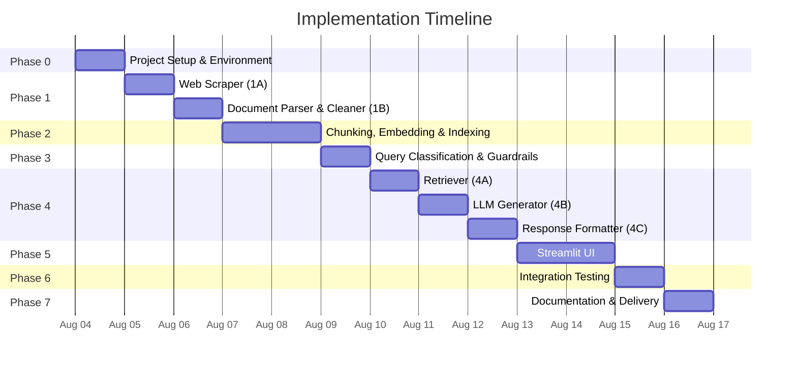
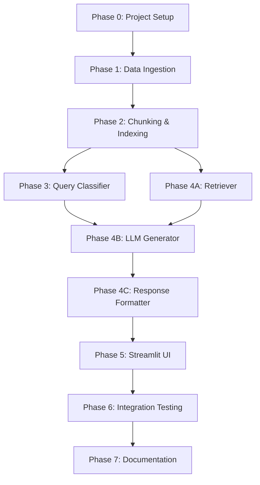

# Implementation Plan: Mutual Fund FAQ Assistant (RAG Chatbot)

> Phase-wise breakdown derived from the [architecture.md](file:///d:/DRIVE%20F/RAG%20CHATBOT/docs/architecture.md)

---

## Phase 0 — Project Setup & Environment

**Goal**: Set up the project skeleton, dependencies, and configuration.

**Duration**: ~1 day

| # | Task | Files | Details |
|---|------|-------|---------|
| 0.1 | Create project directory structure | All folders | Create `src/`, `data/raw/`, `data/processed/`, `vectorstore/`, `config/`, `docs/` |
| 0.2 | Initialize Python virtual environment | — | `python -m venv venv` and activate |
| 0.3 | Create `requirements.txt` | [requirements.txt](file:///d:/DRIVE%20F/RAG%20CHATBOT/requirements.txt) | `requests`, `beautifulsoup4`, `langchain`, `langchain-community`, `langchain-groq`, `chromadb`, `sentence-transformers`, `streamlit`, `python-dotenv` |
| 0.4 | Create `.env` template | [.env](file:///d:/DRIVE%20F/RAG%20CHATBOT/.env) | Placeholder for `GROQ_API_KEY` |
| 0.5 | Create `config/settings.py` | [settings.py](file:///d:/DRIVE%20F/RAG%20CHATBOT/config/settings.py) | Centralise all constants: URLs list, chunk size (500), overlap (50), top-K (3–5), temperature (0.1), max tokens (150) |
| 0.6 | Create `.gitignore` | [.gitignore](file:///d:/DRIVE%20F/RAG%20CHATBOT/.gitignore) | Ignore `venv/`, `.env`, `vectorstore/`, `data/raw/`, `__pycache__/` |

**Exit Criteria**: `pip install -r requirements.txt` succeeds. All directories exist. Config loads without errors.

---

## Phase 1 — Data Ingestion (Offline Pipeline)

**Goal**: Scrape the 5 Groww URLs, clean the HTML, and save structured text files.

**Duration**: ~2 days

### Phase 1A — Web Scraper

| # | Task | File | Details |
|---|------|------|---------|
| 1A.1 | Build scraper for Groww scheme pages | [scraper.py](file:///d:/DRIVE%20F/RAG%20CHATBOT/src/scraper.py) | Use `requests` + `BeautifulSoup4` to fetch and parse each URL |
| 1A.2 | Extract meaningful sections | [scraper.py](file:///d:/DRIVE%20F/RAG%20CHATBOT/src/scraper.py) | Target sections: scheme name, expense ratio, exit load, minimum investment, SIP details, risk level, benchmark, fund manager, category |
| 1A.3 | Save raw HTML per scheme | `data/raw/` | Save as `hdfc_mid_cap.html`, `hdfc_flexi_cap.html`, etc. |

> [!NOTE]
> Groww pages are JavaScript-rendered. If `requests` fails to capture content, consider using `selenium` or `playwright` as a fallback. Verify scraped content before proceeding.

### Phase 1B — Document Parser & Cleaner

| # | Task | File | Details |
|---|------|------|---------|
| 1B.1 | Strip HTML tags, nav bars, footers, ads | [parser.py](file:///d:/DRIVE%20F/RAG%20CHATBOT/src/parser.py) | Use BeautifulSoup and regex class matching to remove noise (headers, footers, nav, sidebars) |
| 1B.2 | Structure cleaned text | [parser.py](file:///d:/DRIVE%20F/RAG%20CHATBOT/src/parser.py) | Convert block-level elements to double-newlines (`\n\n`) to create natural breakpoints for chunking |
| 1B.3 | Extract metadata per document | [parser.py](file:///d:/DRIVE%20F/RAG%20CHATBOT/src/parser.py) | Scheme name, source URL, category, scrape date |
| 1B.4 | Save processed text files | `data/processed/` | One `.txt` file per scheme with associated `.json` metadata |

**Exit Criteria**: 5 clean text files in `data/processed/`, each with accurate metadata. Manual review confirms no junk content.

---

## Phase 2 — Chunking, Embedding & Indexing

**Goal**: Split documents into chunks, generate embeddings, and store them in ChromaDB.

**Duration**: ~1–2 days

| # | Task | File | Details |
|---|------|------|---------|
| 2.1 | Implement text chunker | [parser.py](file:///d:/DRIVE%20F/RAG%20CHATBOT/src/parser.py) | Use `RecursiveCharacterTextSplitter` — chunk size: 2000 chars (~500 tokens), overlap: 200 chars (~50 tokens) |
| 2.2 | Attach metadata to each chunk | [parser.py](file:///d:/DRIVE%20F/RAG%20CHATBOT/src/parser.py) | Each chunk carries: `scheme_name`, `source_url`, `category`, `scraped_date`, `chunk_index` |
| 2.3 | Generate embeddings | [embedder.py](file:///d:/DRIVE%20F/RAG%20CHATBOT/src/embedder.py) | Load `BAAI/bge-small-en-v1.5`. Since chunks are ~500 tokens, they fit perfectly within the 512-token context limit of `bge-small`. A larger model is unnecessary for factual mutual fund queries and would only add latency. |
| 2.4 | Store in ChromaDB | [embedder.py](file:///d:/DRIVE%20F/RAG%20CHATBOT/src/embedder.py) | Create a persistent ChromaDB collection in `vectorstore/`, store embeddings + metadata |
| 2.5 | Verify index | [embedder.py](file:///d:/DRIVE%20F/RAG%20CHATBOT/src/embedder.py) | Run a sample query to confirm retrieval returns relevant chunks |

**Exit Criteria**: ChromaDB collection populated. Test query `"expense ratio HDFC Mid-Cap"` returns relevant chunks with correct metadata.

---

## Phase 3 — Query Classification & Guardrails

**Goal**: Build the safety layer that classifies queries and detects PII before they enter the RAG pipeline.

**Duration**: ~1 day

| # | Task | File | Details |
|---|------|------|---------|
| 3.1 | Keyword-based advisory detection | [classifier.py](file:///d:/DRIVE%20F/RAG%20CHATBOT/src/classifier.py) | Pattern list: `"should I"`, `"which is better"`, `"recommend"`, `"best fund"`, `"invest in"`, `"compare"` |
| 3.2 | PII regex filters | [classifier.py](file:///d:/DRIVE%20F/RAG%20CHATBOT/src/classifier.py) | Detect PAN (`[A-Z]{5}[0-9]{4}[A-Z]`), Aadhaar (`[0-9]{12}`), phone (`[0-9]{10}`), email patterns |
| 3.3 | LLM-based classification fallback | [classifier.py](file:///d:/DRIVE%20F/RAG%20CHATBOT/src/classifier.py) | For ambiguous queries, use a short LLM prompt: *"Is this query factual or advisory?"* |
| 3.4 | Refusal response generator | [classifier.py](file:///d:/DRIVE%20F/RAG%20CHATBOT/src/classifier.py) | Return polite refusal + AMFI/SEBI educational link |
| 3.5 | Unit tests for classifier | `tests/test_classifier.py` | Test with known advisory, factual, and PII-containing queries |

**Exit Criteria**: All test cases pass. Advisory queries are refused. PII queries are blocked. Factual queries pass through.

---

## Phase 4 — Retrieval & LLM Response Generation

**Goal**: Wire up semantic search → context assembly → LLM generation → response formatting.

**Duration**: ~2 days

> [!NOTE]
> **Retrieval Strategy — informed by vectorstore analysis**
>
> - **38 total chunks** across 5 schemes (Nippon: 13, Axis: 7, HDFC Mid/Small: 6 each, ICICI: 6)
> - **Embedding dimensions**: 384 (BAAI/bge-small-en-v1.5, normalized)
> - **Chunk sizes**: 267–1999 chars (avg ~1881 chars ≈ 470 tokens)
> - **Metadata per chunk**: `scheme_name`, `source_url`, `category`, `scraped_date`, `chunk_index`
> - **Observed relevance scores**: Scheme-specific factual queries score 0.55–0.71; generic queries ~0.47–0.49
> - **Strategy**: Use `similarity_search_with_relevance_scores` with top-K=5 and a minimum score threshold of 0.35 to filter noise. De-duplicate source URLs from chunk metadata for citation. Assemble context as numbered chunks with scheme attribution.

### Phase 4A — Retriever

| # | Task | File | Details |
|---|------|------|---------|
| 4A.1 | Load persistent vectorstore | [retriever.py](file:///d:/DRIVE%20F/RAG%20CHATBOT/src/retriever.py) | Connect to existing ChromaDB at `vectorstore/` with the same BGE embedding function |
| 4A.2 | Semantic search with scores | [retriever.py](file:///d:/DRIVE%20F/RAG%20CHATBOT/src/retriever.py) | Use `similarity_search_with_relevance_scores()`, top-K=5, threshold=0.35 |
| 4A.3 | Context assembly | [retriever.py](file:///d:/DRIVE%20F/RAG%20CHATBOT/src/retriever.py) | Combine retrieved chunks into a structured context string with numbered chunks and scheme attribution. Collect unique source URLs from metadata. |

### Phase 4B — LLM Generator

| # | Task | File | Details |
|---|------|------|---------|
| 4B.1 | System prompt setup | [generator.py](file:///d:/DRIVE%20F/RAG%20CHATBOT/src/generator.py) | Implement the core system prompt from architecture (7 rules) |
| 4B.2 | Prompt template construction | [generator.py](file:///d:/DRIVE%20F/RAG%20CHATBOT/src/generator.py) | Build the `Context + Source URLs + User Question` template |
| 4B.3 | LLM API integration | [generator.py](file:///d:/DRIVE%20F/RAG%20CHATBOT/src/generator.py) | Call Groq API via `langchain-groq` with `llama-3.3-70b-versatile`, temperature=0.1, max_tokens=150 |
| 4B.4 | Error handling | [generator.py](file:///d:/DRIVE%20F/RAG%20CHATBOT/src/generator.py) | Handle API errors, rate limits, timeouts gracefully with user-friendly fallback messages |

### Phase 4C — Response Formatter

| # | Task | File | Details |
|---|------|------|---------|
| 4C.1 | Citation link validation | [formatter.py](file:///d:/DRIVE%20F/RAG%20CHATBOT/src/formatter.py) | Check if response contains a source URL; inject from metadata if missing |
| 4C.2 | Footer date enforcement | [formatter.py](file:///d:/DRIVE%20F/RAG%20CHATBOT/src/formatter.py) | Ensure `"Last updated from sources: <date>"` is appended |
| 4C.3 | Sentence count enforcement | [formatter.py](file:///d:/DRIVE%20F/RAG%20CHATBOT/src/formatter.py) | Truncate to ≤ 3 sentences if the LLM exceeds the limit |

**Exit Criteria**: End-to-end test — a factual query returns a correctly formatted 3-sentence response with citation and date footer. Refusal queries return the refusal template.

---

## Phase 5 — User Interface (Stitch)

**Goal**: Build a minimal, functional chat interface using Stitch.

**Duration**: ~1–2 days

| # | Task | File | Details |
|---|------|------|---------|
| 5.1 | App layout | [app.py](file:///d:/DRIVE%20F/RAG%20CHATBOT/src/app.py) | Header with title + disclaimer badge |
| 5.2 | Welcome panel | [app.py](file:///d:/DRIVE%20F/RAG%20CHATBOT/src/app.py) | Greeting message + 3 clickable example questions |
| 5.3 | Chat input & display | [app.py](file:///d:/DRIVE%20F/RAG%20CHATBOT/src/app.py) | Interactive chat input and threaded conversation display using Stitch components |
| 5.4 | Wire up pipeline | [app.py](file:///d:/DRIVE%20F/RAG%20CHATBOT/src/app.py) | Connect input → classifier → retriever → generator → formatter → display |
| 5.5 | Disclaimer footer | [app.py](file:///d:/DRIVE%20F/RAG%20CHATBOT/src/app.py) | Persistent disclaimer: *"Facts-only. No investment advice."* |
| 5.6 | Basic styling | [app.py](file:///d:/DRIVE%20F/RAG%20CHATBOT/src/app.py) | Clean layout, readable fonts, proper spacing using Stitch's styling capabilities |

**Exit Criteria**: Running the Stitch app launches a working chat interface. Users can ask questions and receive formatted responses.

---

## Phase 6 — Integration Testing & Validation

**Goal**: Validate the complete system end-to-end against the success criteria.

**Duration**: ~1 day

| # | Test Case | Expected Outcome |
|---|-----------|-----------------|
| 6.1 | Factual query: *"What is the expense ratio of HDFC Mid-Cap Opportunities Fund?"* | ≤ 3 sentences, correct data, citation link, date footer |
| 6.2 | Factual query: *"What is the lock-in period for HDFC ELSS Tax Saver Fund?"* | Correct lock-in info (3 years), citation, footer |
| 6.3 | Factual query: *"What is the minimum SIP amount for HDFC Flexi Cap Fund?"* | Correct amount, citation, footer |
| 6.4 | Advisory query: *"Should I invest in HDFC Mid-Cap?"* | Polite refusal + educational link |
| 6.5 | Comparison query: *"Which fund is better?"* | Polite refusal + educational link |
| 6.6 | PII query: *"My PAN is ABCDE1234F, check my returns"* | Blocked with privacy notice |
| 6.7 | Out-of-scope query: *"Tell me about SBI mutual funds"* | *"I don't have this information in my current sources."* |
| 6.8 | Performance query: *"What are the returns of HDFC Flexi Cap?"* | Link to official factsheet only |

**Exit Criteria**: All 8 test cases pass. No hallucinated data. No advisory leaks.

---

## Phase 7 — Documentation & Delivery

**Goal**: Prepare the final README and ensure all deliverables are complete.

**Duration**: ~0.5 day

| # | Task | File | Details |
|---|------|------|---------|
| 7.1 | Write README | [README.md](file:///d:/DRIVE%20F/RAG%20CHATBOT/README.md) | Setup instructions, selected AMC & schemes, architecture overview, known limitations |
| 7.2 | Review problem statement | [problemstatement.md](file:///d:/DRIVE%20F/RAG%20CHATBOT/docs/problemstatement.md) | Ensure it reflects the final implementation |
| 7.3 | Review architecture doc | [architecture.md](file:///d:/DRIVE%20F/RAG%20CHATBOT/docs/architecture.md) | Update any deviations from the plan |
| 7.4 | Final `.gitignore` check | [.gitignore](file:///d:/DRIVE%20F/RAG%20CHATBOT/.gitignore) | Confirm `.env`, `vectorstore/`, `venv/` are excluded |

---

## Phase 8 — Scheduler Component

**Goal**: Implement a daily scheduler to automate data ingestion (scraping, parsing, embedding) so the knowledge base stays up-to-date.

**Duration**: ~1 day

| # | Task | File | Details |
|---|------|------|---------|
| 8.1 | Build orchestration script | `src/scheduler.py` | Create a script that sequentially runs `scraper.py`, `parser.py`, and `embedder.py` |
| 8.2 | Create GitHub Actions workflow | `.github/workflows/scheduler.yml` | Implement a workflow triggered by `schedule` (cron) to run the orchestration script once every 24 hours (e.g., at midnight) |
| 8.3 | Configure secrets & environment | `.github/workflows/scheduler.yml` | Ensure the workflow has access to any required environment variables (like GROQ_API_KEY) via GitHub Secrets |
| 8.4 | Update documentation | `README.md` | Add instructions on how the GitHub Actions scheduler works and how to modify the cron schedule |

---

## Timeline Summary

**Estimated Total Duration**: ~10–12 days

---

## Dependency Graph

> [!TIP]
> **Phase 3** (Classifier) and **Phase 4A** (Retriever) can be developed in parallel since both depend on Phase 2 but not on each other.
